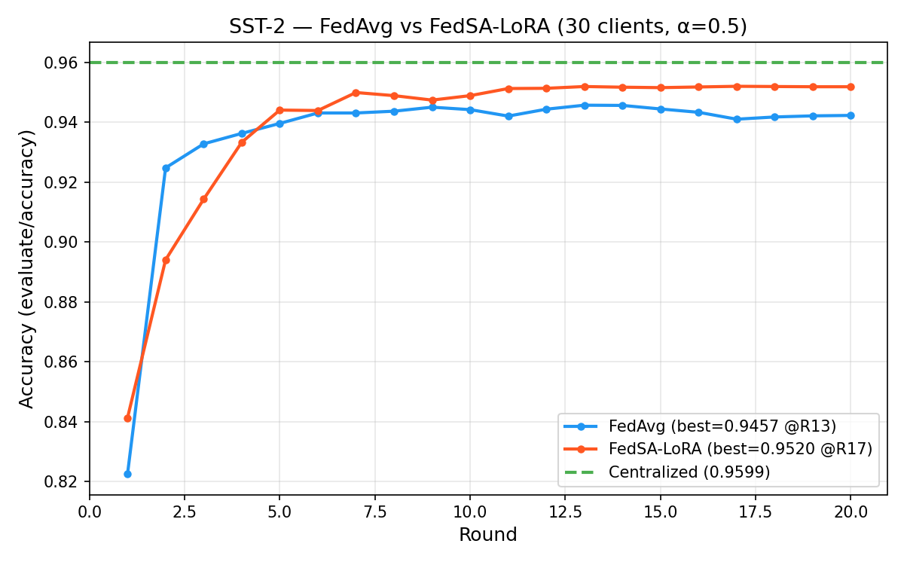
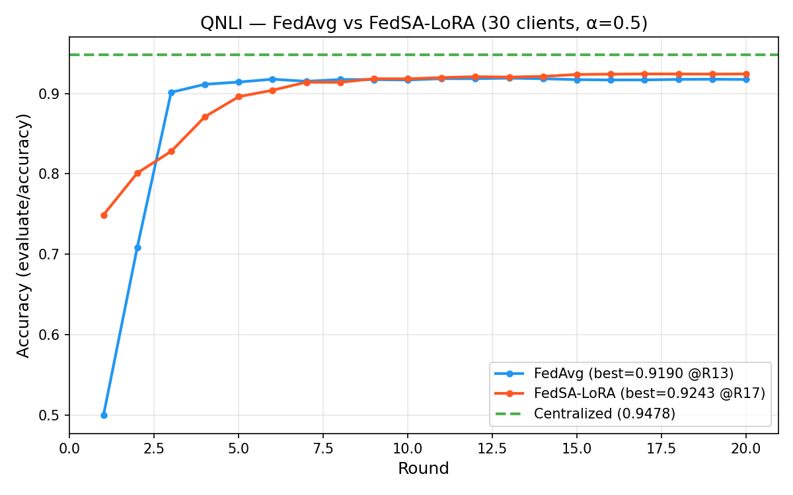
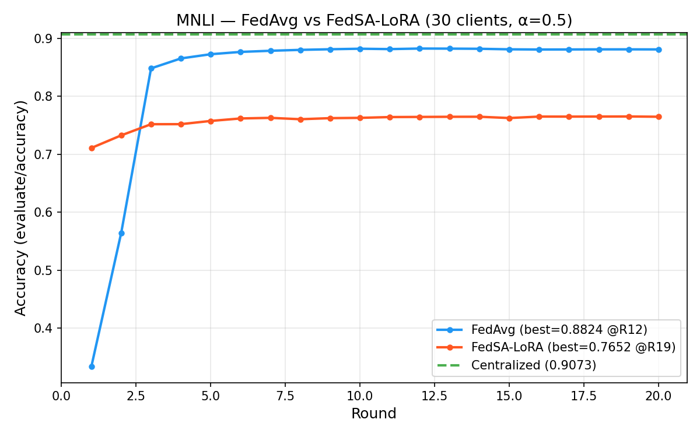
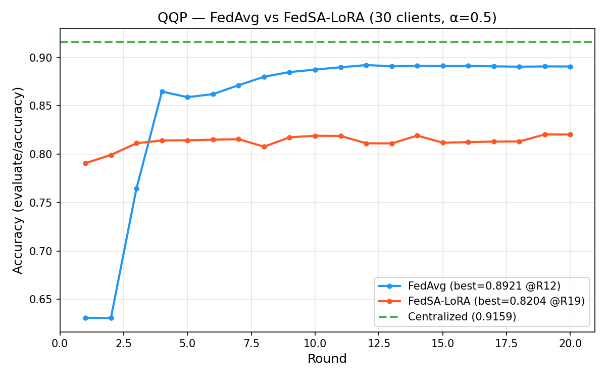
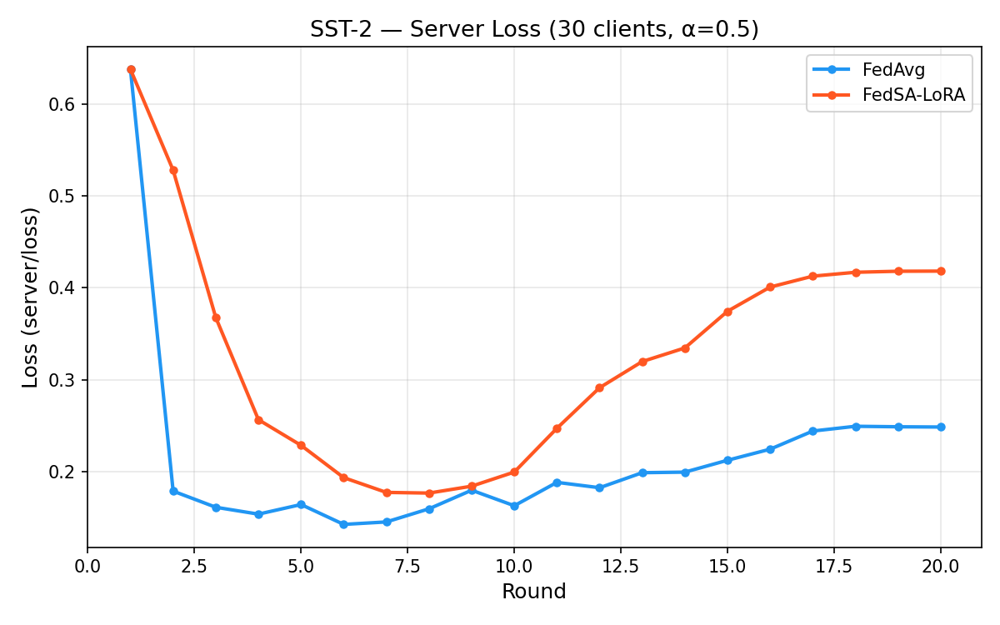
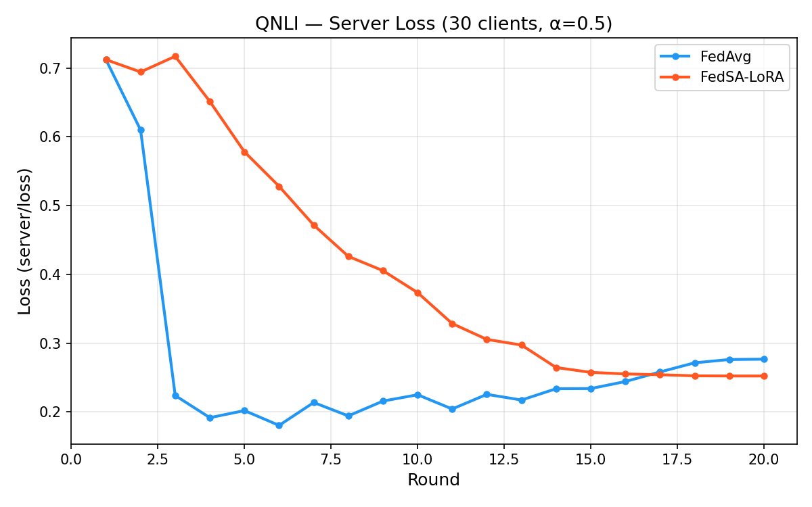
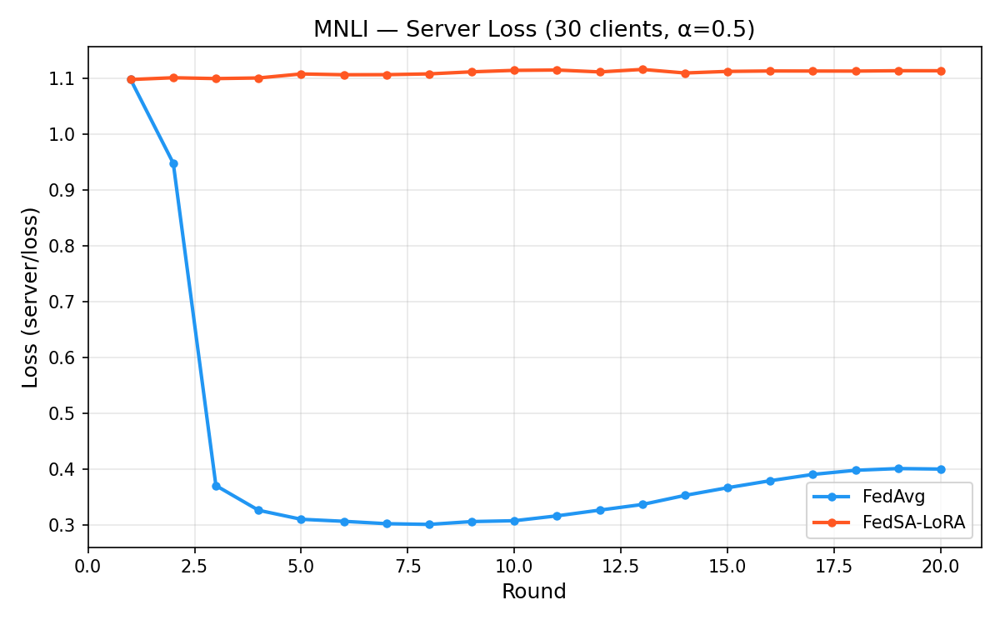
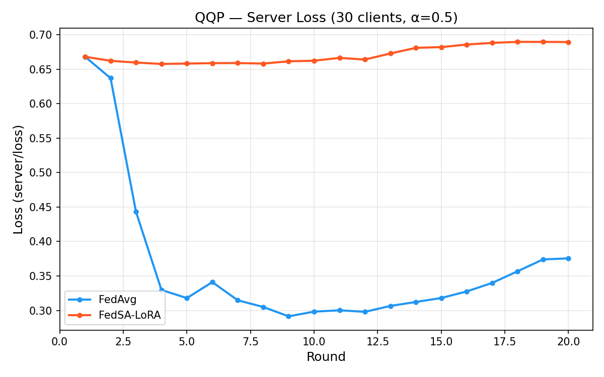

# FedAvg vs FedSA-LoRA 實驗比較

> 30 clients, Dirichlet α=0.5, RoBERTa-large, LoRA r=8, 20 rounds, 1 local epoch

## 實驗結果

### Best Model Accuracy（選 `evaluate/accuracy` 最高的 round）

| Task | Centralized | FedAvg (best) | FedAvg (min) | FedSA (best) | FedSA (min) |
|------|------------|---------------|-------------|-------------|------------|
| SST-2 | **0.9599** | 0.9457 @R13 | 0.8621 | 0.9520 @R17 | 0.7778 |
| QNLI | **0.9478** | 0.9190 @R13 | 0.8667 | 0.9243 @R17 | 0.6977 |
| MNLI | **0.9073** | 0.8824 @R12 | 0.8121 | 0.7652 @R19 | 0.3552 |
| QQP | **0.9159** | 0.8921 @R12 | 0.8393 | 0.8204 @R19 | 0.4915 |

### 跨 Client 離散度（best round 的 std）

| Task | FedAvg std | FedSA std |
|------|-----------|-----------|
| SST-2 | 0.025 | 0.050 |
| QNLI | 0.018 | 0.068 |
| MNLI | 0.029 | **0.206** |
| QQP | 0.025 | **0.137** |

## 觀察

### 1. SST-2 / QNLI：FedSA 略勝 FedAvg

- SST-2: FedSA 0.9520 > FedAvg 0.9457（+0.63%）
- QNLI: FedSA 0.9243 > FedAvg 0.9190（+0.53%）
- 兩個都是 binary classification，FedSA 的個人化 B 矩陣有幫助
- 但 FedSA 的 min 更低、std 更大，代表跨 client 變異度較高

### 2. MNLI / QQP：FedSA 顯著落後 FedAvg

- MNLI: FedSA 0.7652 << FedAvg 0.8824（-11.72%）
- QQP: FedSA 0.8204 << FedAvg 0.8921（-7.17%）
- FedSA 的 std 極大（MNLI=0.206），部分 client 只有 35% accuracy
- 可能原因：
  - **20 rounds 不夠讓 A 矩陣收斂**（FedSA 的 best round 在 19，還在爬升）
  - **MNLI 是 3-class**，classifier 有 3 行，non-IID 下本地 classifier 更容易偏
  - **QQP 資料量大**（364K），每輪 1 epoch 的 local update 量大，B 矩陣 drift 嚴重

### 3. Best round 的分佈

- FedAvg: best round 在 12-13（中期就收斂）
- FedSA: best round 在 17-19（後期還在改善，可能需要更多 rounds）

### 4. Centralized 始終是 upper bound

所有 FL 方法都低於 centralized，差距 1-14%。

## Accuracy 曲線

| SST-2 | QNLI |
|-------|------|
|  |  |

| MNLI | QQP |
|------|-----|
|  |  |

## Server Loss 曲線

| SST-2 | QNLI |
|-------|------|
|  |  |

| MNLI | QQP |
|------|-----|
|  |  |

## 指標說明

| 指標 | wandb key | 意義 |
|------|-----------|------|
| best accuracy | `evaluate/accuracy` (max over rounds) | 每個 client 在 local valid split 上測，取 weighted avg |
| min accuracy | `evaluate/accuracy_min` (at best round) | 最差 client 的 accuracy |
| std | `evaluate/accuracy_std` (at best round) | 跨 client accuracy 標準差 |
| server loss | `server/loss` | server 用 global model (agg_A + avg_B) 在 centralized valid set 測 |

### Best model 選法

```
best_round = argmax(evaluate/accuracy over rounds 1~20)
```

不選最後一輪，因為後期可能 overfitting（loss 上升但 accuracy 下降）。

### FedAvg vs FedSA 的 evaluate/accuracy 差異

- **FedAvg**: 每個 client 用**同一個 global model** 在 local split 測
- **FedSA**: 每個 client 用**個人化 model (global_A + own_B + own_classifier)** 在 local split 測
- 兩者都用 `evaluate_metrics_aggregation_fn` 算 weighted average，公平比較

## 實驗設定

| 參數 | 值 |
|------|-----|
| Model | roberta-large (355M) |
| LoRA | r=8, α=16, target=Q,K,V,dense |
| Clients | 30 |
| Dirichlet α | 0.5 |
| Rounds | 20 |
| Local epochs | 1 |
| Optimizer | AdamW, cosine annealing |
| LR | 0.001 (max) |
| Batch size | 32 (effective 128 with grad_accum=4) |
